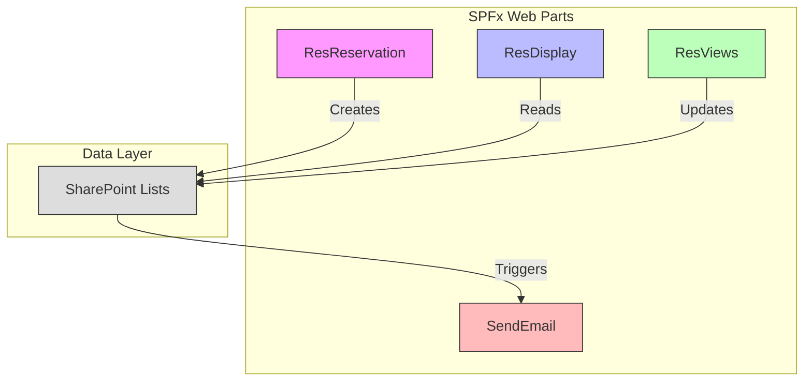
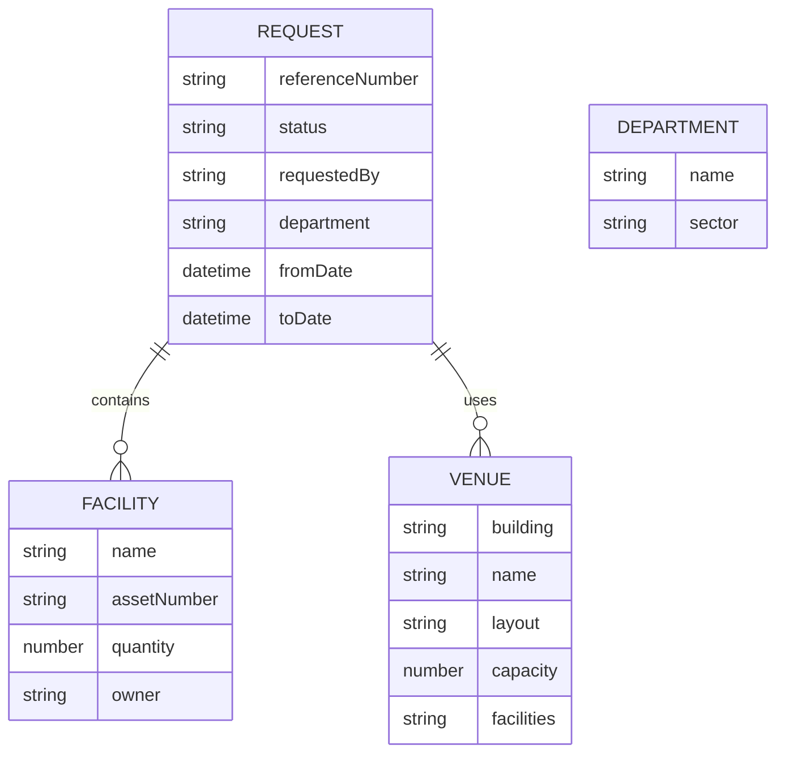
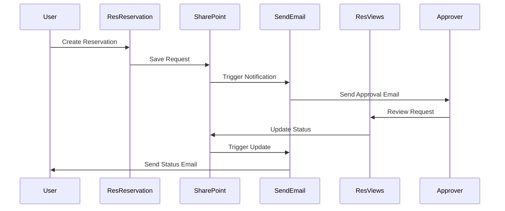
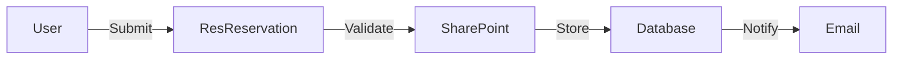
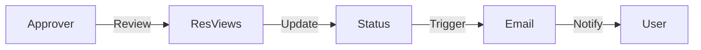
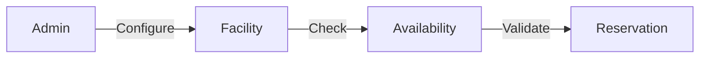

# System Architecture

## Overview

The Resource Reservation System (RRS) is built using the SharePoint Framework (SPFx), designed to provide a robust and scalable solution for managing facility reservations within an organization. The system follows a component-based architecture pattern, leveraging React for the user interface and SharePoint lists for data persistence.

## System Decomposition

The system is decomposed into four primary web parts, each serving distinct functionalities within the reservation ecosystem:

**1. Reservation Management (ResReservation)**

The Reservation Management component serves as the primary interface for users to create and submit reservation requests. At its core is the Reservation Form Handler, which provides an intuitive form interface for users to input reservation details. The Facility Selection System integrates with SharePoint lists to present available facilities and their current status, enabling users to make informed choices. The Date/Time Management system implements complex logic for checking facility availability and preventing double-bookings. The Validation Service ensures data integrity by validating user inputs against business rules and facility constraints. The SharePoint Integration Service handles all data operations, managing the communication between the form interface and SharePoint lists while maintaining data consistency.

**2. Reservation Display (ResDisplay)**

The Display component focuses on presenting reservation information in a clear and organized manner. The Display Renderer implements responsive design patterns to ensure optimal viewing across different devices and screen sizes. The Basic Information Display section presents key reservation details in a user-friendly format, while the Facility List Viewer provides a comprehensive view of all facilities included in the reservation. The File Attachment Handler manages the display and download of any documents associated with the reservation, integrating seamlessly with SharePoint's document management capabilities. This component emphasizes user experience by presenting complex reservation data in an easily digestible format.

**3. Reservation Views (ResViews)**

This component manages the various ways reservation data can be viewed and processed, particularly focusing on the approval workflow. The Approver Interface provides authorized users with the tools needed to review and process reservation requests. The Status Management system tracks the lifecycle of each reservation, from submission through approval or rejection. The Filtering System enables users to sort and filter reservations based on various criteria such as date, status, or facility. The Custom Table Views feature allows different user roles to see relevant information in their preferred format, enhancing the efficiency of the approval process.

**4. Email Notification (SendEmail)**

The Email Notification component handles all communication aspects of the reservation system. The Email Template Manager maintains a collection of standardized templates for different types of notifications, ensuring consistent communication. The Notification Service integrates with SharePoint's email capabilities to send automated notifications at key points in the reservation lifecycle, such as submission confirmations, approval requests, and status updates. This component plays a crucial role in keeping all stakeholders informed throughout the reservation process.

## Data Layer Architecture

    The system utilizes SharePoint lists as its primary data store, with the following key structures:

    1. **Request List**: Stores main reservation details
    2. **Venue List**: Manages venue information and availability
    3. **Facility List**: Tracks facility inventory and assignments
    4. **Department List**: Maintains organizational structure
    5. **User Groups**: Manages permissions and approvals

## Component Collaboration

The system components interact through the following patterns:

1. **Reservation Flow**:
   - ResReservation creates new requests
   - SharePoint Service validates and stores data
   - SendEmail notifies relevant stakeholders
   - ResViews enables approver actions
   - ResDisplay shows current status

2. **Approval Workflow**:
   - Automated status tracking (Pending → Approved/Rejected)
   - Role-based access control (CRSD, DD, FSS groups)
   - Email notifications at each stage

## Design Patterns Used

1. **Component Pattern**: Used throughout the React implementation for modular UI components
2. **Service Pattern**: Implemented in SharePointService for data access abstraction
3. **State Management**: Utilizing React state for component-level data
4. **Factory Pattern**: For creating standardized form elements
5. **Observer Pattern**: For handling real-time updates and notifications

## Rationale for System Decomposition

The system was decomposed into these specific components for several reasons:

1. **Separation of Concerns**: Each web part handles a distinct aspect of the reservation system
2. **Maintainability**: Modular design allows for easier updates and bug fixes
3. **Scalability**: Components can be enhanced independently
4. **Reusability**: Common components (e.g., FacilityList, DateTimePicker) are shared across web parts
5. **Security**: Role-based access control is easier to implement and maintain

## System Behavior

### Key Workflows:

1. **Reservation Creation**:

2. **Approval Process**:

3. **Facility Management**:

## Integration Points

1. **SharePoint Integration**:
   - Lists and libraries for data storage
   - User groups for permission management
   - Site assets for venue images

2. **Email System Integration**:
   - Automated notifications
   - Status updates
   - Reminder system

## Technical Considerations

1. **Performance**:
   - Optimized SharePoint queries
   - Efficient state management
   - Lazy loading of components

2. **Security**:
   - Role-based access control
   - Data validation
   - Input sanitization

3. **Scalability**:
   - Modular architecture
   - Reusable components
   - Extensible data structures

This architecture provides a robust foundation for the reservation system while maintaining flexibility for future enhancements and modifications. The component-based approach ensures that new features can be added with minimal impact on existing functionality.
